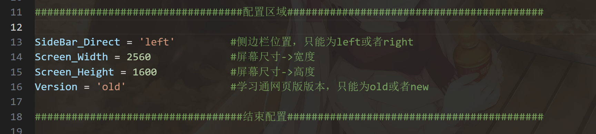
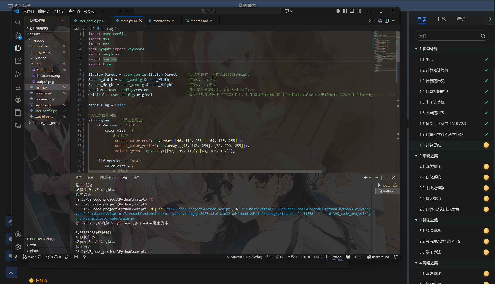
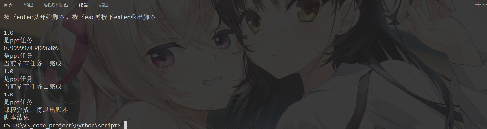

# 脚本介绍

## 简介：
- 这是一个基于 __Opencv__ 以及 __Pyautogui__ 库作为核心写的一个依靠纯视觉，键鼠模拟的网页版学习通刷课脚本，新版或者旧版的网页版学习通都能使用
- 纯视觉检测+键鼠模拟，没有用爬虫，应该比较安全

## 脚本功能：
- 自动刷ppt课件：识别ppt并且模拟键鼠向下滚动刷ppt
- 自动刷视频：识别视频并且点击刷视频
- 识别任务点是否完成：课程所有任务点完成后自动退出脚本

## 使用说明：
1. ### 配置

- 配置区域在config.py文件的顶部，根据自身设备信息和使用场景配置即可
- __关于配置详情，请见注意事项！__

2. ### 启动

- 配制完成后再执行main.py
- 脚本开始执行之后，会输出提示：按下enter键以开始刷课，按下esc之后再按下enter则直接退出脚本
- __在按下enter开始脚本之前，必须要在屏幕上留下侧边栏的位置，不然纯视觉检测不到任务点，会导致脚本无法正常运行__

3. ### 日志输出

- 输出的数字为相似度，用于监视时间线上前后界面的变化
- 根据相似度会判断未完成任务点是什么类型的任务（只能识别ppt，视频）

4. ### 退出
- 刷课过程中按下esc以结束脚本，防止脚本程序抢鼠标，或者直接将鼠标移动至屏幕四个角落也能退出脚本（__Pyautogui__ 的保护特性，__有时脚本出错没有检测到esc就只能用这种方法退出脚本了__）

## 注意事项：
- 关于配置：
    - SideBar_Direct配置章节侧边栏位置（left或right）
    - Screen_Width配置屏幕像素宽度
    - Screen_Height配置屏幕像素高度
    - Version配置网页版的版本（new或old）
    - Original配置网页是否使用强制改颜色的插件（如果是原生态的学习通网页，配置True；使用了插件配置False，这里插件只支持edge浏览器上的 __Dark Reader__ 插件）
- 如果是新版本学习通网页，网页缩放比例必须为 __100%__，如果是旧版可以缩放，但也不能太夸张
- 可能存在很多漏洞，毕竟只用自己电脑跑过该脚本